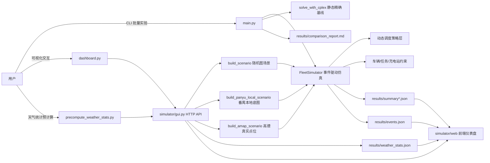
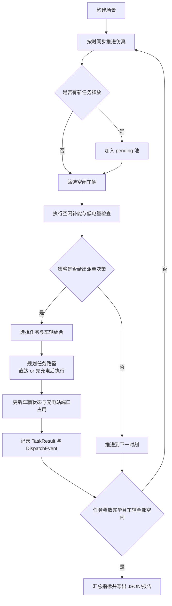
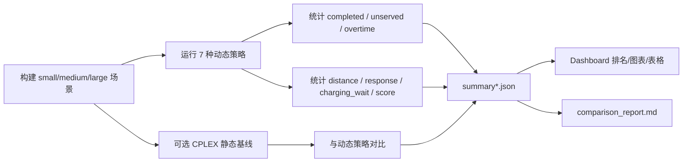

# 新能源物流车队协同调度仿真系统

一个面向课程项目与算法实验的新能源物流调度平台，覆盖动态任务生成、在线派单、多车协同、充电站排队、天气/路况扰动、静态精确基线对比，以及 Web 仪表盘回放与结果分析。

## 项目概览

本项目围绕“中央仓库 + 新能源车队 + 城市动态任务”场景展开，目标是在载重、电量、时间窗和充电资源受限的前提下，比较不同调度策略的表现，并通过可视化方式展示派单过程与实验结果。

项目同时支持两类研究视角：

- 在线动态调度：任务按时间释放，策略只能基于当前状态做决策。
- 静态全信息基线：使用 CPLEX 对已知全任务集合进行精确求解，作为上界参考。

---

## 核心能力

- 支持 `small / medium / large` 三种场景规模。
- 支持 7 种动态调度策略：
  - `nearest_task_first`
  - `max_task_first`
  - `urgency_distance`
  - `auction_multi_agent`
  - `metaheuristic_sa`
  - `reinforcement_q`
  - `hyper_heuristic_ucb`
- 车辆约束建模：载重、电池容量、速度、单位里程能耗、可用时刻。
- 充电约束建模：充电站功率、端口数、排队等待、空闲补能。
- 多车协同：超重任务可由多车按容量比例协同执行。
- 天气/路况扰动：`normal / rain / congestion` 三种模式，影响交通倍率与回放效果。
- 地图来源可切换：
  - 随机路网仿真图
  - 番禺本地底图/道路骨架图
  - 高德地图真实 POI 与驾车路线
- Web 仪表盘支持：
  - 单次仿真回放
  - 策略排名对比
  - 基准实验结果可视化
  - 天气统计表加载与筛选
- 输出实验产物：
  - `summary*.json`
  - `events.json`
  - `comparison_report.md`
  - `weather_stats.json`

---

## 技术路线与架构图

### 1. 总体架构



### 2. 核心仿真流程



### 3. 实验评估路线



---

## 技术实现要点

### 1. 图与场景建模

- `simulator/graph.py` 使用邻接表存储加权图，并通过 Dijkstra 计算最短路径。
- `simulator/simulation.py` 负责构造三种规模的随机城市图与任务/车辆/充电站配置。
- `simulator/amap_integration.py` 支持基于高德地图 POI 生成真实场景，并调用驾车路径接口获取回放路线。
- `simulator/panyu_local_map.py` 可从本地番禺底图中抽取道路骨架，构建可回放的区域路网。

### 2. 动态调度与约束处理

- `FleetSimulator` 采用事件驱动的时间推进机制。
- 任务按 `release_time` 动态进入待派单池。
- 每次决策综合考虑车辆当前位置、载重、电量、任务时限与回仓需求。
- 当电量不足时，系统会在“先服务任务”与“先充电再服务”之间自动规划。
- 充电站通过“端口最早可用时间”模拟排队等待与资源竞争。

### 3. 策略层

- 规则启发式：最近任务优先、最大任务优先、紧急度-距离综合。
- 多智能体启发式：拍卖式派单。
- 近似优化/学习策略：模拟退火、Q-learning、UCB 超启发式。
- 协同派单场景下，系统可将超重任务分配给多辆车共同执行，并按容量比例分摊载重。

### 4. 精确基线

- `simulator/exact_solver.py` 提供静态全信息 MIP 求解逻辑。
- 当前命令行入口实际开放的是 `CPLEX` 基线。
- 对 `medium / large` 场景，代码内置了许可证安全缩减逻辑，避免受限版 CPLEX 因模型规模过大直接失败。
- 仓库保留了 `Gurobi` 适配代码，但当前主入口与仪表盘默认围绕 CPLEX 结果工作。

### 5. 可视化层

- `dashboard.py` 启动本地 HTTP 服务并自动打开浏览器。
- `simulator/gui.py` 负责 API 与结果装配。
- `simulator/web/` 提供前端页面、回放逻辑、图表/表格展示与地图叠加。
- 结果文件位于 `results/`，可直接被仪表盘读取。

---

## 项目结构

```text
.
├─ main.py                         # 批量实验入口，输出 summary / report
├─ dashboard.py                    # Web 仪表盘入口
├─ precompute_weather_stats.py     # 天气统计预计算脚本
├─ requirements-optional-solvers.txt
├─ results/                        # 实验输出与缓存结果
├─ simulator/
│  ├─ graph.py                     # 加权图与最短路
│  ├─ models.py                    # Task / Vehicle / Station / Event 数据模型
│  ├─ strategies.py                # 动态调度策略
│  ├─ simulation.py                # 场景生成与事件驱动仿真
│  ├─ exact_solver.py              # 静态精确求解
│  ├─ gui.py                       # Dashboard 后端 API
│  ├─ amap_integration.py          # 高德 POI / 路线集成
│  ├─ panyu_local_map.py           # 番禺本地底图场景构建
│  ├─ offline_cache/               # 离线番禺缓存与路由缓存
│  └─ web/                         # 前端页面与静态资源
└─ README.md
```

---

## 环境与依赖

### Python 版本

- 建议 `Python 3.10+`

### 依赖分层说明

| 使用场景 | 是否需要第三方依赖 | 说明 |
| --- | --- | --- |
| `main.py` 纯随机图批量实验 | 否 | 仅使用 Python 标准库 |
| `dashboard.py` Web 仪表盘 | 是 | 需要 `Pillow`，因为本地底图模块在导入阶段会加载 |
| `precompute_weather_stats.py` | 是 | 同样依赖 `Pillow`（通过 `simulator.gui` 导入） |
| CPLEX 静态精确基线 | 是 | 需要 `docplex` 和 `cplex` |
| 高德地图真实点位/路线 | 可选 | 需要设置环境变量 `AMAP_KEY`，并具备网络访问能力 |

### 推荐安装方式

```bash
python -m venv .venv
```

Windows PowerShell:

```powershell
.venv\Scripts\Activate.ps1
python -m pip install --upgrade pip
pip install pillow
```

如果需要静态精确基线：

```bash
pip install docplex cplex
```

也可以直接安装仓库内列出的可选求解器依赖：

```bash
pip install -r requirements-optional-solvers.txt
```

---

## 快速开始

### 1. 启动 Web 仪表盘

```bash
python dashboard.py
```

默认地址：

```text
http://127.0.0.1:8765
```

仪表盘可完成：

- 单次仿真运行与回放
- 策略排名对比
- `results/summary*.json` 可视化
- `results/weather_stats.json` 读取与筛选

### 2. 运行动态策略基准实验

```bash
python main.py --no-oracle --allow-collaboration --seed-runs 3 --output results/summary_dynamic.json
```

含义：

- `--no-oracle`：不运行静态精确基线
- `--allow-collaboration`：允许多车协同服务超重任务
- `--seed-runs 3`：每个场景重复 3 次，输出均值/标准差

### 3. 运行动态 vs 静态（CPLEX）对比

```bash
python main.py --allow-collaboration --exact-backend cplex --exact-scales small medium large --output results/summary_cplex.json
```

说明：

- `main.py` 当前仅暴露 `cplex` 作为静态精确后端。
- 当 `medium / large` 模型超出受限许可证能力时，程序会自动尝试缩减版精确求解。

### 4. 导出回放事件

```bash
python main.py --no-oracle --export-events --events-output results/events.json
```

### 5. 预计算天气统计结果

```bash
python precompute_weather_stats.py --seed 20260309 --exact-time-limit 120 --exact-mip-gap 0.0
```

输出文件：

- `results/weather_stats.json`

---

## 地图模式说明

### 1. 随机图模式

- 默认模式
- 不依赖地图服务
- 适合快速做算法对比和批量实验

### 2. 番禺本地底图模式

- 当选择地图模式且城市/区县为广州番禺时，优先尝试本地底图/道路骨架模式
- 依赖：
  - `simulator/web/assets/panyu-basemap.png`
  - `Pillow`
- 已构建好的模板和路线缓存存放在 `simulator/offline_cache/`

### 3. 高德地图模式

Windows PowerShell:

```powershell
$env:AMAP_KEY="Your_api_key"
python dashboard.py
```

开启后可使用真实城市 POI 生成任务点、充电站和回放路线。

---

## 输出文件说明

| 文件 | 说明 |
| --- | --- |
| `results/summary.json` | 默认实验汇总输出 |
| `results/summary_dynamic.json` | 动态策略对比结果 |
| `results/summary_cplex.json` | 动态 vs 静态精确基线结果 |
| `results/events.json` | 回放事件流，需加 `--export-events` |
| `results/comparison_report.md` | 自动生成的 Markdown 对比报告 |
| `results/weather_stats.json` | 不同天气/路况下的策略统计结果 |

核心评估指标包括：

- `completed`
- `unserved`
- `overtime`
- `distance`
- `avg_response_time`
- `charging_wait`
- `score`

---

## 结果解释建议

- `score` 是综合收益指标，越高越好。
- `completed` 越高越好，`unserved / overtime` 越低越好。
- `distance` 反映总运输里程。
- `avg_response_time` 反映从任务释放到完成的平均响应耗时。
- `charging_wait` 反映充电拥塞带来的额外等待成本。
- 在协同模式下，部分超重任务会由多车共同完成，因此应结合 `events.json` 与回放观察任务拆分细节。

---

## 与代码实现一致的几个注意点

- `dashboard.py` 与 `precompute_weather_stats.py` 都会间接导入 `simulator/panyu_local_map.py`，因此实际运行时需要 `Pillow`。
- 仪表盘默认优先读取 `results/summary_cplex.json`、`results/summary_dynamic.json` 等现有结果文件进行展示。
- 天气统计页默认读取 `results/weather_stats.json`；若文件不存在，界面会提示缺失。
- `comparison_report.md` 是运行 `main.py` 时默认生成的产物，除非显式传入 `--no-report`。
- 静态精确基线是“全信息一次性求解”，与在线动态调度不属于同一信息条件，应作为参考上界而不是直接等价比较。

---

## 适合在答辩/报告中强调的亮点

- 从数据结构、调度算法、离散事件仿真到前端回放形成完整闭环。
- 不是单一启发式，而是同时比较规则法、拍卖式、多策略超启发式与学习策略。
- 显式建模了新能源车场景中的关键现实约束：电量、充电等待、天气扰动、多车协同。
- 同时提供在线动态策略和离线静态精确基线，便于讨论“实时可行性”与“理论上界”之间的差距。

---

## 常用命令速查

```bash
# 纯动态实验
python main.py --no-oracle --allow-collaboration --seed-runs 3 --output results/summary_dynamic.json

# 动态 vs CPLEX
python main.py --allow-collaboration --exact-backend cplex --exact-scales small medium large --output results/summary_cplex.json

# 导出回放事件
python main.py --no-oracle --export-events --events-output results/events.json

# 天气统计预计算
python precompute_weather_stats.py --seed 20260309 --exact-time-limit 120

# 启动 Dashboard
python dashboard.py
```

---

## 后续可扩展方向

- 引入更真实的任务收益模型与多仓库设定。
- 将充电策略与派单策略联合优化。
- 补充更严格的实验配置管理与批量日志。
- 将静态精确模型扩展为更贴近动态仿真的充电排队版本。
- 将现有前端面板进一步整理为论文/课程展示专用看板。
